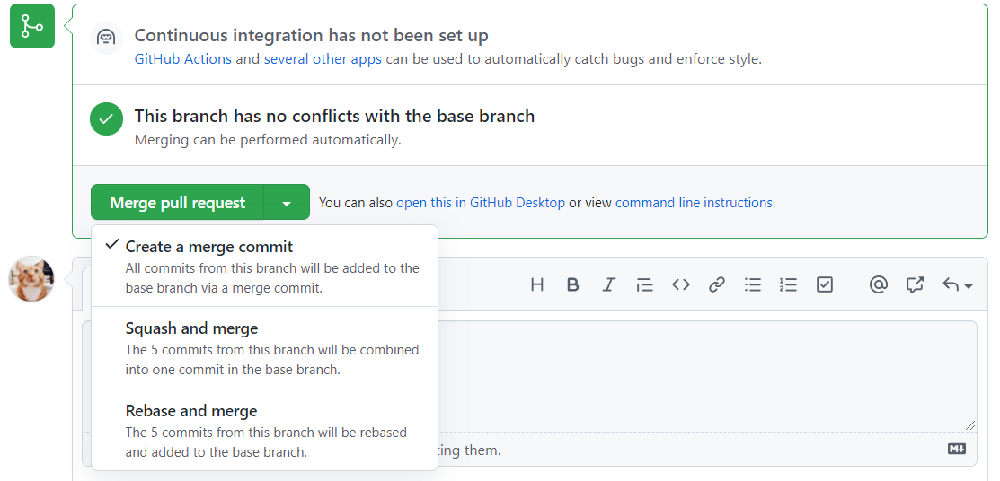
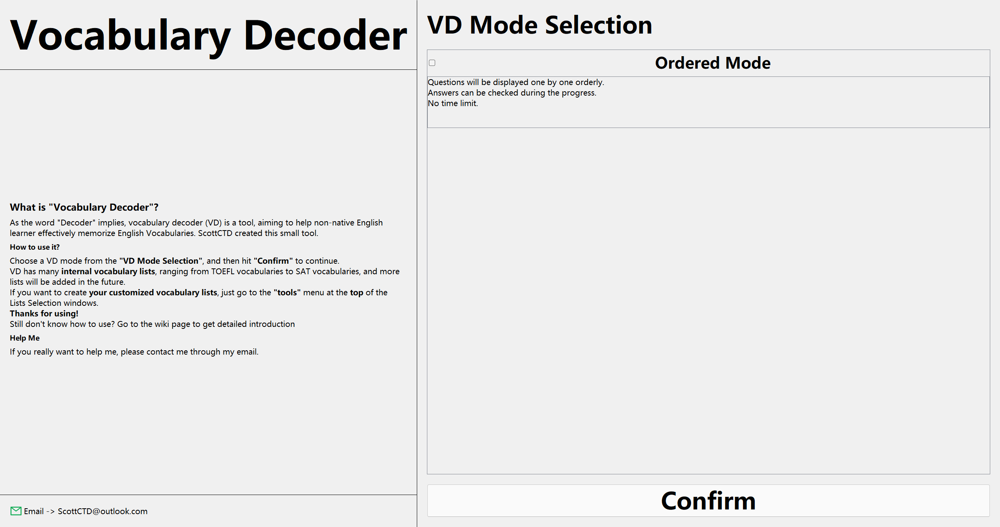

- This is a scratch work for discussion, not a grammar strict thing.

# About Git and GitHub

- We need to be very familiar with git and GitHub.

- [GitHub Discussion](https://github.com/UofT-CS-Group/CSC110-Final-Project/discussions)
    - Put any ideas and questions on it.
    - I will upload this file to Discussion as well.
- [GitHub Project](https://github.com/UofT-CS-Group/CSC110-Final-Project/projects/1)
    - We could put some TODOs and DOINGs to avoid conflicts.
- Other people won't see our project, I will make it public after the due date.
- I will make some `.gitignore`s to exclude those unnecessary files.
    - Like .idea and some temp or cache folders.

# Project Convention

- Good habits are very important.
- So that if everyone agree with one convention, argument will be minimized.
- It's ok to forget, I will handle them.

## Files

- Try our best to *avoid space character* in naming files / directories.

- The outermost directories are separated modules, name in `UpperCamelCase`.
- Under each module, we will mostly use `lower_underscore_case` to name our main files and directories.
    - For each *.py* and *resource / asset* file, we use `lower_underscore_case`.
    - For other cases, we may use some special names for them.
        - Like `README.md`
- All suffix should be in lower case.
    - Like `ray.py` 
- All source codes will be in `Application `folder for easy access. 

## Code Style

- Everyone must follow a good code style. Mario also highlighted the importance code style.
    - Follow PyCharm code style suggestions, and then we will be good.

- Try not cram many lines of code without breaks. We need to separate code chunks with empty lines according to the meaning of them.

    ```Python
            if "[trait]" in lines[i]:
                in_trait = True
            elif "[/trait]" in lines[i]:
                in_trait = False
            elif "[object]" in lines[i]:
                in_object = True
            elif "[/object]" in lines[i]:
                in_object = False
            elif "[stage]" in lines[i]:
                in_stage = True
            elif "[/stage]" in lines[i]:
                in_stage = False
            elif "[cfg]" in lines[i]:
                in_cfg = True
            elif "[/cfg]" in lines[i]:
                in_cfg = False
            elif "[goal]" in lines[i]:
                in_goal = True
            elif "[/goal]" in lines[i]:
                in_goal = False
    #... 150 more lines of this
    ```

- Please use full variable name if possible!
    - No lat, we need to say latitude.
- Use the aliases in `typing `module.
    - Like instead of `list`, we could use `List` from typing module.

## Commit and Pull Request

- Every commit should contain meaningful message.
- Try to split a huge commit into smaller ones, this will help reviewers.
- When merging pull requests,
    - if the pull request is about *one* functionality but there are many many commits about this single functionality, try `Squash and merge`.
    - if the pull request is very good, a functionality with *few* commits (1 - 3), try `Rebase and merge`.
    - Try *not* use `Create a merge commit`.

- Delete your branch after someone merged your pr.

# Program Overview

- What we need to do?

## Loading...

- If our data take too much time to process, it is better to have a loading window displaying 0% to 100%.
    
- So that our dear prof Mario could stuck at 99% and give us a big **0**.

## Data Processing

- General Idea: We need to load data into many Python classes.
- [Ray's Pull Request](https://github.com/UofT-CS-Group/CSC110-Final-Project/pull/3)
- More details in architecture part.

## Visualizations

- [PyQt5 Tutorial 中文](https://maicss.gitbook.io/pyqt5-chinese-tutoral/jie-shao)
- [Matplotlib Tutorial English](https://github.com/rougier/matplotlib-tutorial)
- [Matplotlib 中文网](https://www.matplotlib.org.cn/)
- Much more on GitHub

### Main GUI

#### Layout

- Where we should place a button, a picture, or a label?
- Shitty layout example, pls not do it!

- We should make our layout compact and informative.
    - **No** long text.
    - **No** too much space.
    - **No** big and lubber font.
    - **No** absolute spacing. 
        - We need our GUI widgets to be flexible with different resolutions and window sizes.
    - **No** excessive big icons.

#### Style

- Idk, I'm a blockhead in 美术.
- ~~Like windows 11 or mac default style? that's greaaaat!~~

### Interactive Graphs

#### Matplotlib

- I didn't learn it. I'm sorry.

#### Graph by Hand

- Let go OneNote!

# Program Architecture

- Discuss!
- Instead of specific to our datasets, we should make a program that could analyze any dataset as long as we correctly convert raw data into Python objects.

## Data Storage and Class Hierarchy

- Partial TBD
    - We need to learn matplotlib to finalize this part.
- Module: `data`
    - ALL_COVID_CASES: list[CovidCaseData]
        - This should be sorted by date
    - ALL_SCHOOL_CLOSURES: list[SchoolClosureData]
        - This should be sorted by date

- BaseData(object)
    - TimeBasedData(BaseData)
        - date: datetime
        - CovidCaseData(ProjectData)
            - city: City
            - province: Province
            - country: Country
            - cases: int
        - SchoolClosureData(ProjectData)
            - country: Country
            - status: ClosureStatus
- ClosureStatus([Enum](https://docs.python.org/zh-cn/3/library/enum.html))
    - CLOSED = 0
    - PARTIALLY_OPEN = 1
    - FULLY_OPEN = 2
    - ACADEMIC_BREAK = 3
- Location(object)
    - name: str
    - Country(Location)
        - iso_code: str
    - Province(Location)
        - country: Country
    - City(Location)
        - province: Province
        - country: Country
- Confusing? Go OneNote!

## Algorithms

- We could write the following by ourselves.
    - We could do running time analysis for each and put it in docstirng.

- Grouping
- Sorting
- Searching
- String Manipulations

## Front Back Separation and Communication

- Since we have a GUI, we need to connect users' operations on GUI with some real actions.
    - Like a user select a country, we need to display the visualization for this country.
- We call GUI **frontend**.
- We call the program that handle users' operations on the frontend **backend**.
- We could write code for doing frontend and backend mixed, but that will make our code shit. 
    - --expansibility
    - --flexibility
    - --...
- Therefore, the best thing to do is separate the GUI and the backend.
- Module: `frontend_main`
    - Main window
    - Class hierarchy WIP
    - I need to learn more PyQt5 to do it.
- Module: `frontend_visualizations`
    - Data visualizations
    - Class hierarchy WIP
- Module: `connector`
    - Bunch of classes and functions used to communicate between GUI and our backend.
- Module: `backend`
    - Code to do some stuff based on the information got by connector.
- Confusing? Go OneNote!
- Module: `main`
    - Module contains the main entry point.
    - Used to init every other module and things required.

## Qt Designer

- We may use it because we separate front and back ends.
- But I think use pure code to generate GUI is good for us to be familiar with PyQt5.

# Assignments

- Discuss!
- Alyssa
- Charlotte
    - Art Works
- Ray
    - Art Works
- Scott

# Key Dates

- We have more than 1 month to finish this one, so if we could do all the stuff required, then we may proceed to make some advanced shit.
- yyyy/mm/dd Next Group Meeting

- 2021/12/14 Due